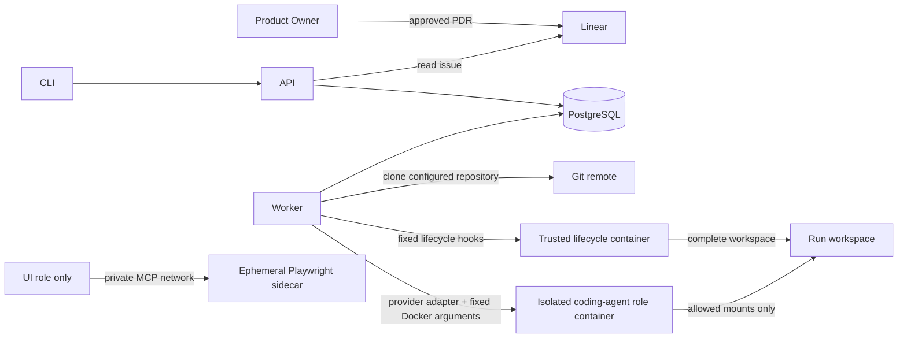

# Architecture

## Current shape

The factory is a supervised local launcher, not a general-purpose orchestration platform.

- **API:** validates a start request, resolves the Linear issue, hashes its immutable snapshot, and
  creates a queued run.
- **Worker:** claims queued and due quota-paused runs, launches roles in order, and stores bounded
  evidence and resumable checkpoints.
- **Codex integration:** asks `feature-intake` for the smallest relevant role set, invokes those
  roles, and always invokes `verifier` last.
- **Lifecycle container:** runs repository-owned setup and deterministic verification hooks with
  explicitly configured network and Docker capabilities and no forwarded factory credentials.
- **Role container:** receives only declared repository mounts, runs as an unprivileged user with a
  read-only root filesystem, dropped capabilities, and no privilege escalation.
- **Browser sidecar:** exists only for a UI role, provides headless Chromium through a private MCP
  endpoint, receives no repository or secrets, and is removed with its dedicated network afterward.
- **PostgreSQL:** stores run state, the PDR snapshot, evidence, checkpoints, quota attempts, and the
  next resume instant.
- **CLI:** starts a run and reads its current state through the API.

## Trust boundaries

`factory.yaml` is trusted operator input. It selects the repository, base branch, model, image, and
literal path groups. Linear PDR text is untrusted requirements data and cannot select repositories,
paths, commands, credentials, or permissions.

The worker is trusted and receives the Docker socket. Agent containers never receive that socket.
Each role gets a separate container. Visible paths are mounted read-only unless the role policy
explicitly grants write access. Unlisted paths are absent.

Trusted per-role configuration also selects read-only skills and an opaque provider model ID. UI
roles may receive the isolated [Playwright sidecar](browser-sidecars.md); other roles cannot reach
its per-role network.

Provider access requires bridge networking. In API key mode a role receives `OPENAI_API_KEY`; in
ChatGPT mode it receives a dedicated writable Codex login cache. Credentials are not placed in the
prompt or stored as evidence, but a role process can read its assigned credential. Stronger
credential mediation is deferred.

Lifecycle hooks are trusted repository code but still run in separate containers. They receive the
complete workspace because dependency preparation and project-wide verification cross role path
groups. Docker authority is disabled by default; when enabled, it is a documented exception capable
of controlling the host daemon.

## Deliberately absent

There is no custom DAG engine, full cross-provider event protocol, mid-turn checkpoint guarantee,
Slack integration, pull-request creation, deployment, release, or unattended approval system.
Quota outcomes and optional continuation identifiers use a small provider-neutral boundary; richer
provider capabilities remain deferred until supervised pilots demonstrate a concrete need.
