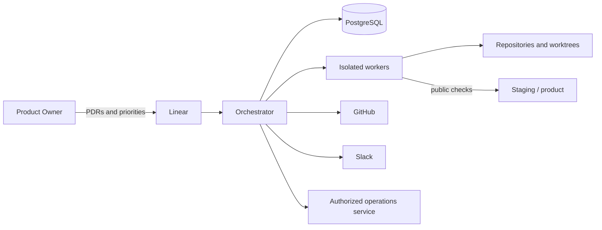

# Architecture

## Goal and boundaries

The factory performs authorized software work while the PO is occupied elsewhere. It receives
approved PDRs, selects the relevant roles, isolates their executions, persists state, and
produces a reviewable proposal. V1 covers product features and infrastructure, including
repositories, environments, CI, and release procedures.

The factory does not create priorities or new PDRs autonomously. The PO supplies an explicit
queue and approves PDRs and dependencies. Automatic goal decomposition and automatic design of
new user experiences remain future capabilities.

## Components

- **Orchestrator:** applies transitions, dependencies, approvals, attempts, and recovery. It
  does not interpret requirements or make product decisions.
- **Worker:** starts one agentic invocation in an ephemeral environment built from a role
  profile.
- **PostgreSQL:** stores technical state, approved snapshots, attempts, and focused diagnostics.
- **Operations service:** holds credentials for deployments, rollbacks, and feature flags and
  performs only predefined operations tied to a precise approval.

The VPS initially runs the orchestrator, workers, and PostgreSQL in containers started by one
script. V1 has no automated disaster recovery for complete VPS loss. A normal restart must
recover persisted work correctly.

## Systems of record

| Information | System of record |
|---|---|
| Editable PDR, priority, dependencies, and visible status | Linear |
| Exact approved PDR snapshot | PostgreSQL |
| Code, contracts, tests, and revision evidence | GitHub |
| Execution state, attempts, and normalized approvals | PostgreSQL |
| Conversations and notifications | Slack |

The pull request includes a comment with the executed PDR, snapshot identifier, and hash. This
copy helps reviewers but does not replace the internal snapshot because a comment can be edited
or deleted.

When systems disagree, the orchestrator suspends the affected work instead of guessing. Before
each transition, it fetches the PDR from Linear and compares its hash with the approved snapshot.

## Configuration

The version-controlled `factory.yaml` describes products and repositories, role/tool/model
assignments, skills, tools, filesystem access, network access, and non-secret operational
settings. The untracked `.env` contains credentials and VPS-specific values; `.env.example`
will document the variables without sensitive values.

An idempotent script validates both inputs and generates tool-specific profiles. Running it
installs a new configuration revision. Active executions keep their existing revision. Applying
a new revision to active work requires suspension and an explicit restart from an appropriate
checkpoint.

V1 operates on one product at a time, but every record includes a product identifier. A product
declares one or more repositories cloned as `.code/<repository>`. Names and paths come from
trusted configuration, never from untrusted PDR text.
