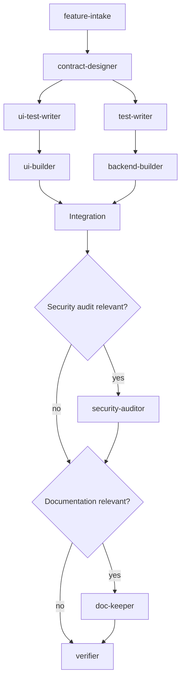

# Workflow

## From PDR to authorized work

1. The PO creates or updates a PDR in Linear and declares its priority and dependencies.
2. `feature-intake` checks ambiguity, unverifiable acceptance criteria, and missing prerequisites.
3. `feature-intake` proposes the smallest relevant role DAG for the PDR.
4. The factory-reviewed PDR enters `factory_accepted`.
5. The PO approves the content and workflow together. PostgreSQL stores an immutable snapshot,
   and the task enters `pm_accepted`.
6. The orchestrator starts the task once its dependencies are satisfied.

Changing requirements, criteria, behavior, a contract, or the workflow requires a proposal that
shows differences and consequences, followed by a new approval tied to the new version. Any
agent may detect the need and request suspension of the affected work. Technical clarifications
that change none of these may be recorded autonomously.

## Selecting the next task

V1 has one active task. It may hold multiple suspended tasks or tasks in review. When the active
task is suspended, another authorized, unblocked task may proceed.

The PO's priority wins among executable tasks. At equal priority, the task that unlocks more
work runs first. An open pull request does not satisfy a code dependency; it must be merged. A
canceled PDR does not satisfy its dependants automatically. The PO must remove the dependency or
approve an alternative.

## UI and backend pipeline

When a PDR changes the UI/backend boundary, `contract-designer` defines the contract first. Two
lanes may then run in parallel, with an initial maximum of two concurrent invocations:



The contract covers operations, data, errors, authorization, compatibility, and examples. The
frontend simulation and real backend derive from the same contract. If an agent discovers that
the contract is impractical, costly, insecure, or incomplete, it suspends the affected work and
reports the problem rather than changing the contract silently.

`feature-intake` removes irrelevant roles from the DAG. A backend-only task omits the UI lane; a
UI-only task uses the existing contract; an infrastructure task goes to `infra-builder` and the
relevant checks. `verifier` always concludes the technical cycle.

## Branches and integration

Each invocation that changes a repository receives an ephemeral container, a dedicated worktree,
and a dedicated branch based on the same approved revision. A sequential role starts from its
predecessor's commits. Parallel lanes stay separate until the task integration branch.

The orchestrator may mechanically merge compatible commits. A conflict returns to the role that
owns the affected area; divergence from the contract suspends the affected work. Branches and
worktrees isolate and attribute changes, while mounts and diff validation enforce role boundaries.

## Verification and correction

`verifier` returns `PASS` or `FAIL` against the criteria, contract, diff, and evidence. On
`FAIL`, it identifies findings and the roles needed. The orchestrator calls only those roles,
while respecting the approved order, for up to three correction cycles. The task then enters
`needs_attention` with its evidence, attempts, and proposal.

Repeating existing roles without changing their order is part of the approved workflow. Adding
a role or changing the DAG, contract, or behavior requires the PO. Quota waits do not consume a
correction cycle.

## States

```text
draft → factory_accepted → pm_accepted → in_progress → in_review → done
```

| State | Meaning |
|---|---|
| `draft` | PDR remains editable and has not passed factory review |
| `factory_accepted` | Factory-reviewed and ready for the PO |
| `pm_accepted` | Approved; starts when unblocked |
| `in_progress` | Execution is in progress |
| `awaiting_input` | A PO answer or decision is required |
| `awaiting_capacity` | A temporary quota is exhausted; recovery is automatic |
| `needs_attention` | A persistent error, invalid configuration, or exhausted correction cycles |
| `in_review` | Pull request and evidence are ready for human review |
| `done` | The approved revision has been merged into the stable branch |

Wait states preserve the checkpoint, work, question, and approved version. A late or duplicate
answer applies only when it identifies the still-open decision and the same version. Uncertainty
or conflict leaves the task suspended.

## Merge, release, and flags

The product has one branch for approved stable code and one for production; their names remain
deferred. Merge and release are separate PO decisions and may happen at different times. A merge
does not trigger deployment. A release selects one complete, immutable stable-branch revision.

Deployments, rollbacks, and feature flag changes use predefined operations in the separate
service that holds credentials. In v1, even rollback and corrective flag shutdown require
approval. Approval identifies the operation, revision, and consequence. Deployment approval
does not authorize flag activation.

`done` closes the task at merge. Releases and flag changes have separate records. V1 flags are
global or target an explicit pilot group. Percentage rollouts and A/B tests are deferred.
